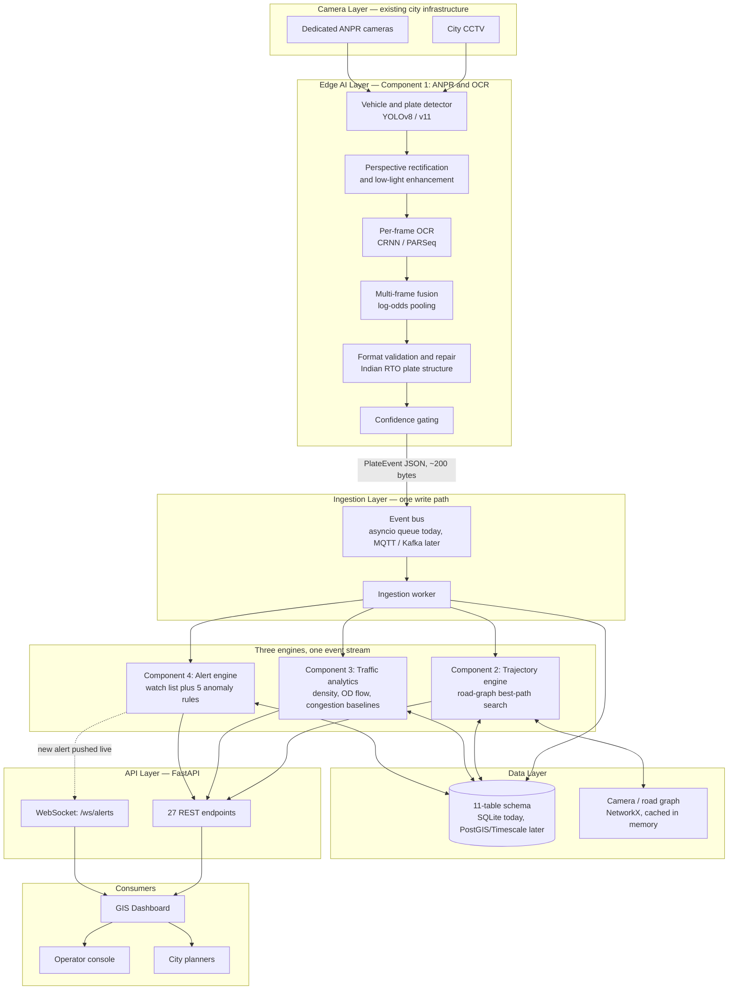
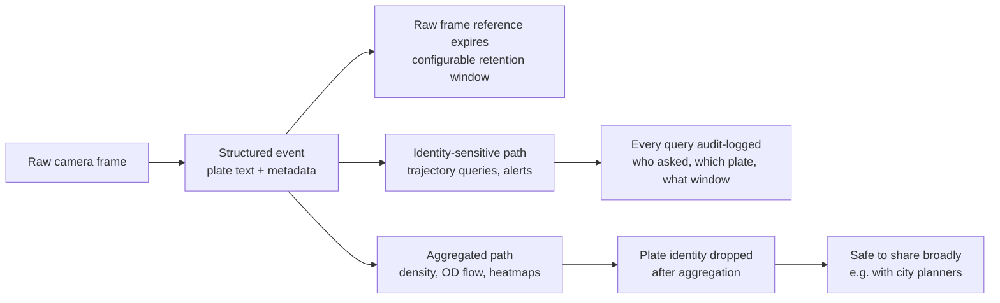

# AETHON

**City-Wide AI Engine for Multi-Camera ANPR Trajectory Tracking and Urban
Traffic Analytics**

SIH 2026 · Problem Statement **26127** · Bharat Electronics Limited · Software
· Smart Automation

A correlation layer over a city's **existing** ANPR/CCTV network. It reads
plates under adverse conditions, stitches sightings of the same vehicle across
cameras into a chronological route on a GIS map, rolls every camera's readings
into city-wide flow analytics, and raises real-time alerts on watch-listed
plates and route anomalies.

No new camera hardware. Only ~200-byte structured events leave each camera
site — never video.

---

## Quick start

```bash
pip install -r requirements.txt

./run.sh seed --hours 12 --vehicles-per-hour 70   # build a demo dataset (~4s)
./run.sh demo                                     # 24-check verification
./run.sh test                                     # 82 tests
./run.sh serve                                    # API on :8000, docs at /docs
```

---

## Architecture

AETHON is built around one idea: **every camera emits the same structured
event, and one event stream feeds three independent engines.** Nothing
downstream cares whether an event came from a real camera or the bundled
simulator — the write path is identical either way. That's what makes the
diagram below true today, not just a target.



### How to read this diagram

**Camera → Edge AI (Component 1).** A vehicle is visible for several
consecutive frames as it approaches a camera. Each frame goes through
detection, perspective rectification (an oblique plate is warped back to
fronto-parallel before OCR), and per-frame OCR. The frames are then **fused**
— not by trusting the single best frame, but by pooling every frame's
character-level confidence as independent evidence (log-odds pooling). This is
where most of the accuracy is actually won: motion blur and glare rarely
corrupt the same character in every frame. The fused text is then checked
against Indian plate format rules (state code + RTO digits + series + number)
and repaired where a format-implied correction exists — `0L4CAF3125` becomes
`DL4CAF3125` because `OL`/`QL` aren't real RTO codes but `DL` is. A confidence
gate decides whether the resulting read is strong enough to ever drive an
alert. Only the final structured event leaves this stage — never a video frame.

**Ingestion.** One write path takes every event, regardless of source (a real
camera, a replay, or the simulator), and fans it out identically to storage
and all three engines. This is intentionally the only place events enter the
system, which is what keeps the three engines honest — none of them can see
anything the others can't.

**Three engines, one stream.**
- *Trajectory* treats the camera network as a road graph and searches for the
  most physically plausible path a plate could have taken — tolerating a
  camera that missed the vehicle, refusing to connect two sightings that would
  require an impossible speed.
- *Analytics* aggregates every observation into per-segment, per-time-bucket
  statistics and scores congestion against that segment's **own** historical
  baseline for that weekday and hour, not a fixed threshold.
- *Alerts* checks every observation against a watch list and five
  route-anomaly rules, and only ever fires on a read confident enough to
  trust.

**Data layer.** SQLite for the demo (the whole system runs on one laptop);
the schema is already shaped for PostGIS (geospatial) and TimescaleDB
(time-bucketed aggregates), so moving to either is a connection-string change,
not a redesign.

**API layer.** All four components are reachable over plain REST; new alerts
are additionally pushed live over WebSocket so a dashboard doesn't have to
poll for them.

### Privacy: how identity-sensitive and aggregate data are kept apart

A city-wide plate reader is a surveillance system if built carelessly. This
split is designed in, not bolted on:



The raw image is retained only long enough to support an active alert or
query, then its reference expires — the plate *text*, not the image, is what
feeds trajectory and analytics. Every identity-sensitive lookup writes an
audit-log entry (who, which plate, what time window) **before** it returns a
result. Aggregate outputs — heatmaps, OD flow, congestion — never carry plate
identity once computed; the origin-destination table has no plate column at
all, by construction.

### The trajectory algorithm, one level deeper

The obvious implementation of "where has this vehicle been" is
`SELECT * WHERE plate = X ORDER BY time`. It breaks on three things that
happen constantly in a real city: a misread character files the right vehicle
under a wrong plate, a missed detection leaves a hole where a camera should
have reported, and two vehicles can genuinely share a plate (cloned, or a
shared misread) — naively concatenating their sightings invents a journey
nobody made.

AETHON instead models the camera network as a directed graph where edges carry
**road-network distance** (never straight-line — a river between two cameras
400m apart can mean a 6km drive). For every pair of sightings it checks
whether the elapsed time is physically plausible for that road distance,
whether the observed direction points toward the next camera, and weighs
recognition confidence — then runs a best-path search over the resulting DAG.
A hop that would imply an impossible speed is rejected and reported *with the
number* (e.g. "228.9 km/h implied over 10.17 km"), which is how a cloned plate
gets caught instead of silently merged into one impossible journey.

---

## The four deliverables

| # | Component | Code | Endpoint |
|---|---|---|---|
| 1 | ANPR & OCR | `app/anpr/` | `POST /api/observations`, `GET /api/benchmark/anpr` |
| 2 | Trajectory reconstruction | `app/engines/trajectory.py` | `GET /api/trajectory/{plate}` |
| 3 | Traffic analytics | `app/engines/analytics.py` | `GET /api/analytics/*` |
| 4 | Alerts | `app/engines/alerts.py` | `GET /api/alerts`, `WS /ws/alerts` |
| — | Governance | `app/models.py` | `GET /api/audit` |

---

## How we're testing it right now

**The data is entirely synthetic — there is no real camera feed and no
trained recognition model behind this yet.** That's stated plainly because it
matters for how to read every number below.

**What generates the test data.** `app/sim/` builds a structurally realistic
but synthetic city: 16 cameras across 6 zones, wired into a 44-edge road graph
with a ring road, radial spokes and an industrial spur, road distances derived
from real coordinates and inflated by a winding factor (road distance is
always longer than straight-line). A traffic generator (`simulator.py`) then
produces vehicle journeys across that graph with a realistic Indian vehicle
mix (42% two-wheelers), time-of-day congestion curves, and weather that comes
and goes. Six scripted scenarios (`scenarios.py`) plant the specific behaviours
each alert rule is designed to catch — a watch-listed vehicle, a cloned plate,
a restricted-zone entry, a loitering pattern, a vehicle breaking its own
routine, and a camera outage — without telling the alert engine what to look
for; the engine has to notice on its own.

**What is and isn't faked.** The simulator fakes the **camera** — it emits
degraded per-frame character reads from known ground truth using a documented
visual-confusion model (the same characters a real OCR model actually confuses:
`0`/`O`/`D`, `1`/`I`, `8`/`B`). It does **not** fake the algorithm: every
simulated read goes through the identical production pipeline — multi-frame
fusion, format validation and repair, confidence gating — that a real camera's
output would go through. So the numbers below measure our correlation and
recognition-support logic, not a hard-coded answer. They do **not** measure a
trained model's accuracy on a real photograph, because no such model is wired
in yet (see *Expected results*, below).

**Current measured results**, from the live demo dataset (16 cameras, 44 road
links, ~3,780 observations, run via `./run.sh seed && ./run.sh demo`):

| Check | Result |
|---|---|
| Unit + integration tests | 82 passing |
| End-to-end verification (`./run.sh demo`) | 24/24 checks passing |
| Recognition accuracy, day/clear | 99.8% (of committed reads) |
| Recognition accuracy, night + rain (weakest bucket) | 96.5% (of committed reads) |
| Recognition accuracy, glare / angled | 98.3% / 99.8% |
| Alert volume | 16 alerts from 3,780 observations — **0.42%** |
| Alert rule coverage | all 5 rules fire on their planted scenario; none fire on the adjacent case they must not (e.g. a permitted delivery fleet, a night-shift vehicle's normal routine) |
| Trajectory reconstruction | correctly bridges a camera outage into one continuous route; correctly refuses to merge a cloned plate's two sightings (rejected as a physically impossible hop) |

Accuracy is always reported **per condition bucket, never blended** — a
system can score 97% on clean daylight footage and still fail the brief if
its adverse-condition accuracy isn't tracked separately. Reproduce any of
these numbers yourself:

```bash
./run.sh seed --hours 12 --vehicles-per-hour 70
./run.sh serve
curl "localhost:8000/api/benchmark/anpr?samples=500"
```

---

## Expected results once fully complete

Three things change between now and a deployment-ready system, and each one
has a concrete target:

**1. Recognition accuracy on real footage, not simulated reads.** We've
identified real datasets to train and validate on: [UVH-26](https://huggingface.co/iisc-aim/UVH-26)
(IISc, 26,646 real images from 2,800 Bengaluru Safe-City CCTV cameras, 1.8M
vehicle boxes) for the detector, and [Indian_LPR](https://github.com/sanchit2843/Indian_LPR)
(16,192 real images, 21,683 plates with character-level ground truth) for the
OCR head. Published baselines for a fine-tuned plate OCR model on Indian
plates sit in the 88–93% single-frame range under adverse conditions; our
contribution is the layer on top of that — multi-frame fusion and format
repair — which is why the target is **>90% per condition bucket**, measured
honestly on a held-out real test set, not blended into one headline number.
The pipeline code does not change to get there: `YoloCrnnRecognizer`
(`backends.py`) is an already-defined interface waiting for trained weights,
and every stage after it (fusion, repair, gating) is already the production
path being exercised today.

**2. Live camera ingestion instead of a simulator.** The production entry
point is already real — `POST /api/observations` is the same endpoint a real
edge box would call. What's missing is an RTSP-to-edge-inference worker
posting to it continuously. No API contract changes.

**3. Production infrastructure behind the same interfaces.** `EventBus` swaps
from an in-process asyncio queue to MQTT (camera→edge) + Kafka (edge→core);
`DATABASE_URL` swaps from SQLite to PostGIS + TimescaleDB; an SSO-backed
identity replaces the free-text `actor` field the audit log already records
against. Each of these is a configuration change behind an interface that
already exists — not a rewrite.

**What the numbers above should look like once all three land:** recognition
accuracy in the same 90%+ per-condition range, now validated against real
photographs instead of a simulated confusion model; alert precision measured
against real operator dispositions (`POST /api/alerts/{id}/acknowledge`
already records confirmed/false-positive/escalated — that data just doesn't
exist yet because there are no real operators using it); and trajectory
reconstruction running against a real city's road graph instead of our
16-camera synthetic one, which mostly changes the *scale* of the graph search,
not its logic — the algorithm treats a 16-node and a 1,600-node graph the same
way.

---

## Layout

```
backend/app/
  anpr/         Component 1 — fusion, format repair, rectification, backends
  engines/      Components 2-4 — camera graph, trajectory, analytics, alerts
  ingest/       one write path; event bus (asyncio now, MQTT/Kafka later)
  sim/          synthetic city, traffic generator, demo scenarios
  api/          FastAPI routers
  models.py     11 tables
backend/tests/  82 tests
scripts/        seed.py, demo.py
docs/           ARCHITECTURE.md · PITCH_SCRIPT.md · HANDOFF.md · SPEC_v2.md
```

## Stack

FastAPI · SQLAlchemy 2 · NetworkX · OpenCV · NumPy · SQLite (→ PostGIS +
TimescaleDB via one connection string).
